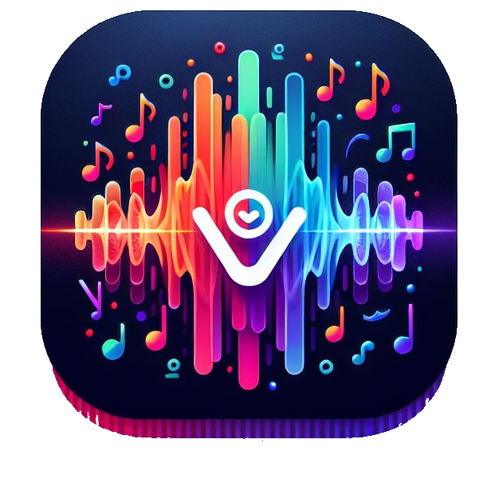
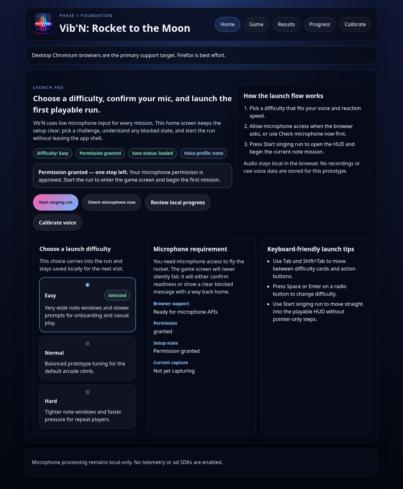
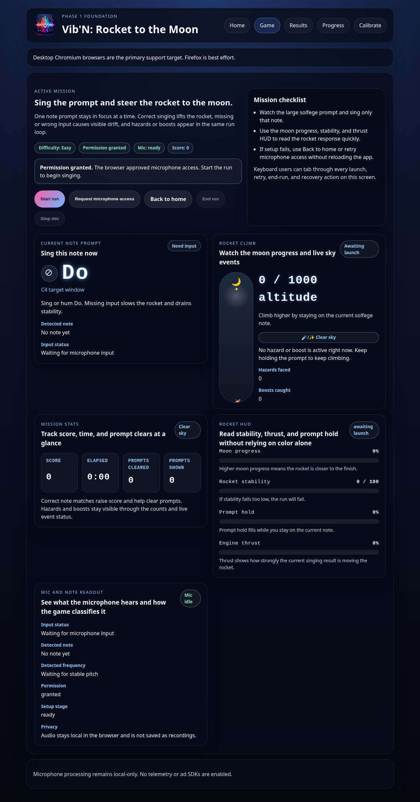
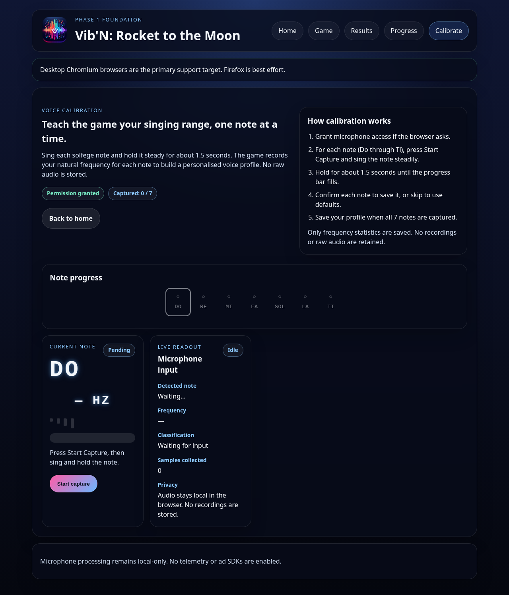
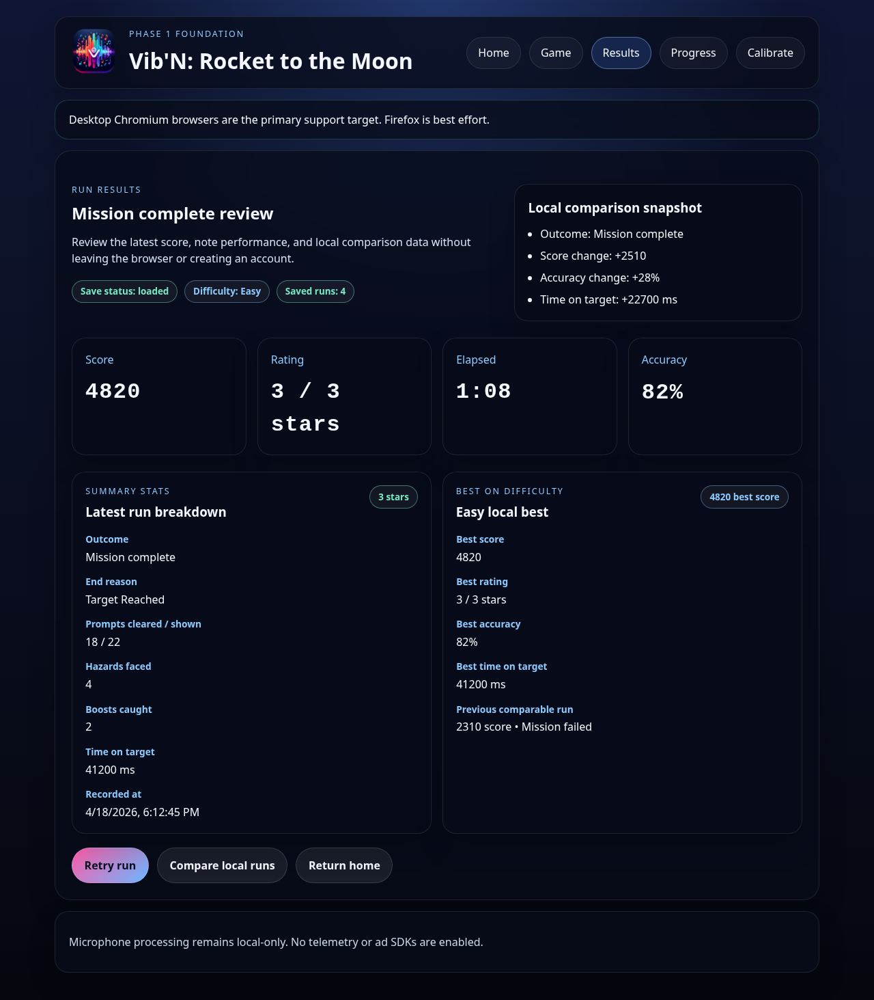
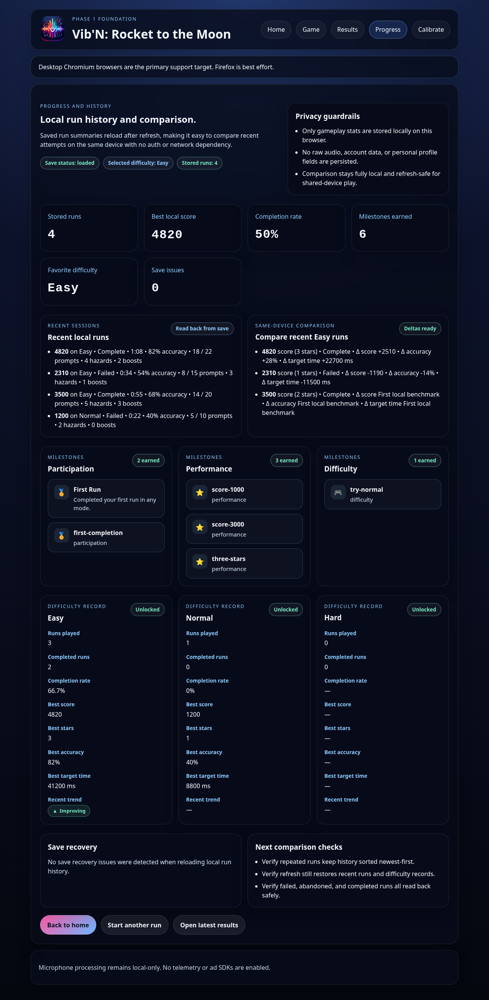

<div align="center">
  

  # Vib'N: Rocket to the Moon

  *A retro singing game where your voice powers a rocket to the moon*

  
  
  
  

  [Features](#features) • [Walkthrough](#walkthrough) • [Getting Started](#getting-started) • [How to Play](#how-to-play) • [Architecture](#architecture) • [Tech Stack](#tech-stack)

</div>

Vib'N turns solfege note matching into an arcade-style rocket flight challenge. Sing **do, re, mi, fa, sol, la, ti** into your microphone to keep a rocket stable, dodge hazards, collect boosts, and reach the moon. Real-time browser pitch detection powers the entire experience — no server, no uploads, no accounts.

## Features

- **Real-time pitch detection** — Browser-based microphone analysis with sub-150ms latency using the Web Audio API and `pitchfinder`
- **Solfege gameplay** — Match prompted notes (do through ti) to control your rocket's altitude and stability
- **Dynamic hazards and boosts** — Asteroid Drift, Solar Flare, Gravity Well, Starlight Burst, and Nebula Shield keep every run different
- **Three difficulty levels** — Easy, Normal, and Hard with scaled note windows, prompt cadence, and event intensity
- **Calibration presets** — Default, Sensitive, and Strict tuning profiles for different skill levels and environments
- **Local progression** — Run history, personal bests, completion rates, trends, and 12 earnable milestones stored in `localStorage`
- **Retro arcade HUD** — Monospace styling, glow effects, and smooth rocket animations with `prefers-reduced-motion` support
- **Accessible by default** — Keyboard navigation, skip links, `aria-live` regions, WCAG AA contrast, and match indicators that don't rely on color alone
- **Privacy-first** — All audio is processed locally and discarded. Only derived gameplay metrics are stored. No accounts, no cloud, no telemetry

## Walkthrough

### Home — Launch Pad

Pick a difficulty, check your microphone, and launch a singing run. The home screen shows your current setup status at a glance including difficulty, mic permission, save state, and voice profile.



### Game — Active Mission

The game HUD shows the current solfege prompt, rocket altitude, stability meters, and live mic readout. Sing the prompted note to climb; wrong notes or silence cause drift.



### Voice Calibration

Teach the game your singing range one note at a time. Sing each solfege note (Do through Ti) and hold it steady. The game records your natural frequencies to build a personalised voice profile.



### Results — Run Review

After each run, review your score, star rating, accuracy, and comparison against previous attempts. New milestones and personal bests are highlighted when earned.



### Progress — History & Milestones

Track your run history, completion rates, difficulty records, trends, and earned milestones. All data stays local in the browser.



> **Regenerate screenshots:** `npm run screenshots` uses Playwright to capture fresh screenshots of every screen.

## Getting Started

### Prerequisites

- [Node.js](https://nodejs.org/) v20.19 or later
- A browser with microphone support (Chrome, Edge, or Firefox recommended)

### Installation

```bash
git clone https://github.com/McFuzzySquirrel/viben.git
cd viben
npm install
```

### Development

```bash
npm run dev
```

Open the URL shown in your terminal (usually `http://localhost:5173`).

### Build and preview

```bash
npm run build
npm run preview
```

### Verify

```bash
npm run typecheck    # Type-check with TypeScript
npm run test         # Run the full test suite (266 tests)
npm run build        # Production build
```

## How to Play

1. **Choose difficulty** — Pick Easy, Normal, or Hard on the home screen
2. **Grant mic access** — Click "Check Mic" and allow browser microphone permission
3. **Launch** — Hit the launch button to start your run
4. **Sing the note** — A solfege prompt appears (e.g. "Do", "Re", "Mi") — sing it to climb
5. **Stay stable** — Correct pitch boosts your rocket; wrong notes or silence cause drift and stability loss
6. **Survive events** — Dodge hazards and ride boosts as they appear throughout the run
7. **Reach the moon** — Hit the target altitude to complete the mission, or lose all stability to fail
8. **Review results** — See your score, accuracy, milestones earned, and personal bests

> [!TIP]
> Start on **Easy** difficulty to get comfortable with the mic setup and note matching before moving up.

## Architecture

The project uses a feature-based module structure:

```
src/
  app/              # Router, providers, shell
  features/
    audio/          # Microphone input, pitch detection, classification
    game/
      engine/       # Simulation, prompts, hazards, tuning (pure functions)
      state/        # Reducer, selectors, run controller
      components/   # HUD — meters, prompt card, rocket, status badge
    progression/    # Milestones, selectors, run history
    settings/       # Difficulty selection state
  screens/          # Home, Game, Results, Progress, NotFound
  shared/
    config/         # Solfege windows, difficulty definitions, privacy
    persistence/    # localStorage adapter with schema versioning
  styles/           # Global CSS with retro dark theme
```

Key design decisions:

- **Deterministic gameplay engine** — All simulation logic is pure functions, making it fully testable without browser APIs
- **Feature isolation** — Audio, game, and progression modules communicate through typed contracts, not direct imports
- **Privacy by architecture** — Audio buffers are never stored; only pitch classification results flow out of the audio module

## Tech Stack

| Layer | Technology |
|-------|-----------|
| UI | React 19, React Router 7 |
| Language | TypeScript 6 |
| Build | Vite 8 |
| Pitch Detection | pitchfinder + Web Audio API |
| Testing | Vitest + React Testing Library |
| Persistence | localStorage (structured, versioned) |
| Styling | CSS with custom properties (no framework) |
